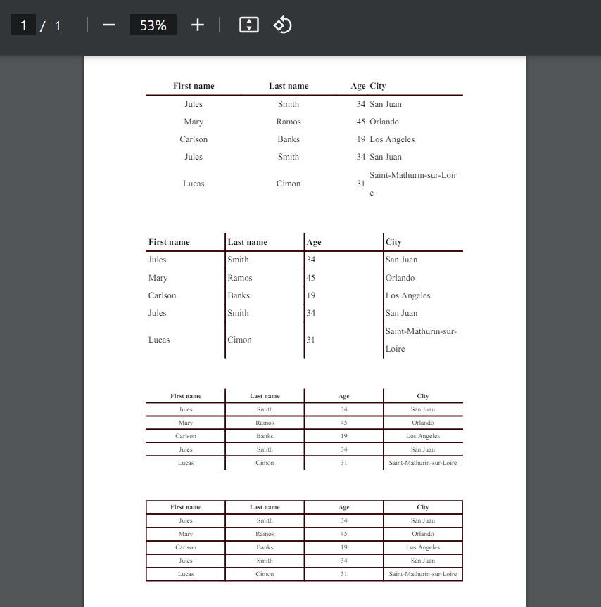

---

# Python FPDF2 Table

***


<b>PdfTable</b> facilita la creación de tablas de datos en PDFs con python usando la librería FPDF2.


---

## Documentación técnica de Python FPDF2 Table

***

### Configuración del entorno de desarrollo.
| Paso   | Descripción                       | comando                             |
| :----  | :----                             | :---                                |
| Paso 1 |  Crear el entorno de trabajo.     | python -m venv env                  |
| Paso 2 | Activar el entorno de trabajo.    | ./env/Scripts/activate              |
| Paso 3 | Actualizar el gestor de paquetes. | python -m pip install --upgrade pip |
| Paso 4 | Prepare la receta de librerías.   | pip install -r requirements.txt     |

***

### Librerías del proyecto.
| librería  | Descripción              | Comando                           |
| :----     | :---                     | :---                              |
| fpdf2      | Permite la creación de PDFs | python -m pip install fpdf2       |

> Con la instalación de la libreria fpdf2 se instalarán las
siguientes librerías de manera automática:


<ul>
<li>defusedxml==0.7.1</li>
<li>fonttools==4.50.0</li>
<li>fpdf2==2.7.8</li>
<li>pillow==10.3.0</li>
</ul>

---

### Realice sus pruebas, actualizaciones o modificaciones.
> Puedes actualizar, contribuir y mejorar el presente software, es libre. Licencia GNU v3.  
No esta permitido modificar la licencia de trabajos derivados de este proyecto.  
Por norma internacional debes conservar el mismo tipo de licencia.

#### Actualizar la receta.

> Si agregas nuevas librerías al proyecto, no olvides actualizar la receta.

``` CMD
pip freeze > requirements.txt
```

---

#### Comprobar que todo está en orden.
| Paso   | Descripción                                   | comando                               |
| :----  | :----                                         | :---                                  |
| Paso 1 | Desactive el entorno de trabajo.              | deactivate                            |
| Paso 2 | Elimine el entorno anterior.                  | rm -R env                             |
| Paso 3 | Cree un entorno de python.                    | python -m venv env                    |
| Paso 4 | Active el entorno de trabajo.                 | ./env/Scripts/activate                |
| Paso 5 | Actualice el gestor de paquetes.              | python -m pip install --upgrade pip   |
| Paso 6 | Instale las librerías necesarias para operar. | pip install -r requirements.txt       |
| Paso 7 | Realice pruebas de rutina.                    |  |
| Paso 8 | Finalice su gestión.                          | deactivate                            |
